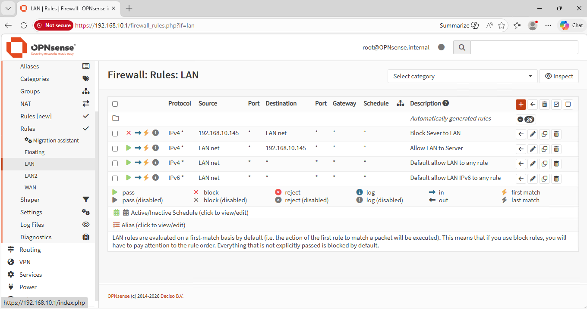
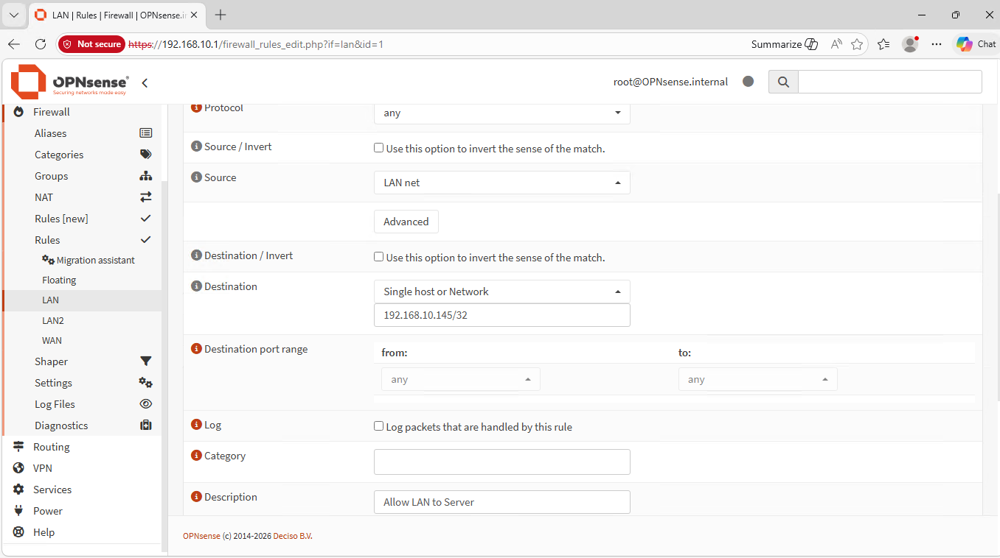
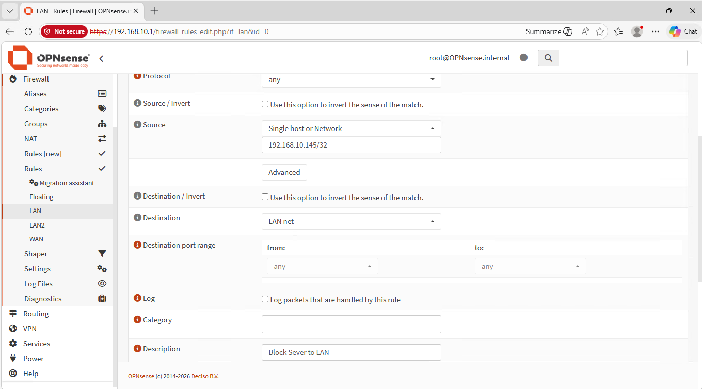
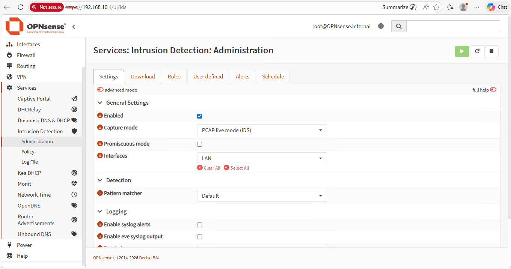
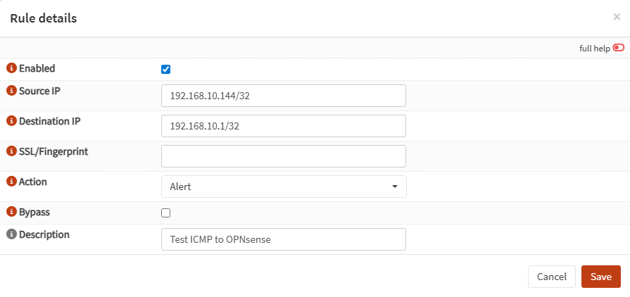
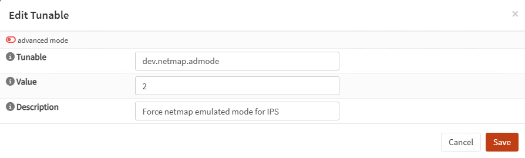
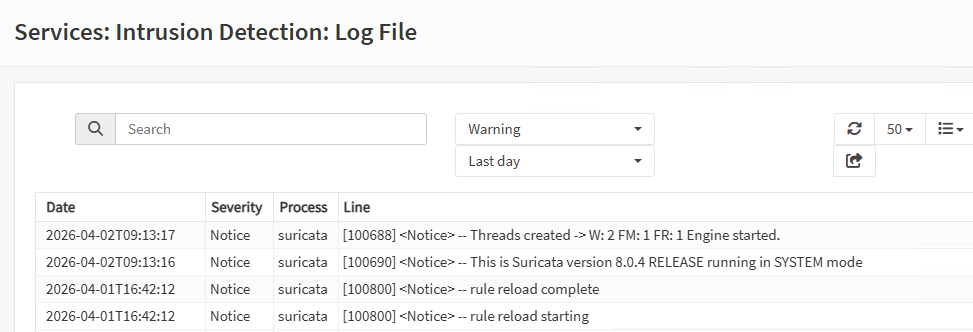

# OPNsense IDS/IPS Lab

A hands-on cybersecurity lab built using Hyper-V and OPNsense to explore firewall rules, intrusion detection, and intrusion prevention in a virtual environment.

This lab demonstrates how to configure LAN firewall rules, enable IDS/IPS in OPNsense, test alert generation, and verify that IPS can actively block traffic.

---

## Lab Overview

This lab simulates a small internal network protected by OPNsense.

Components:

- Hyper-V virtualization
- OPNsense firewall/router
- Windows Server
- Windows 11 client

---

## Network Topology

                    INTERNET
                        |
                   [ WAN - hn0 ]
                        |
                 +----------------+
                 |    OPNsense    |
                 | Firewall/Router|
                 +--------+-------+
                          |
                    [ LAN - hn1 ]
                          |
                   +---------------+
                   |   LAN-Switch   |
                   +-------+--------+
                           |
              +------------+------------+
              |                         |
      Windows Server               Windows 11
      192.168.10.145              192.168.10.144
      GW: 192.168.10.1            GW: 192.168.10.1

---

## Network Design

| Network | Subnet | Gateway | Purpose |
|--------|--------|---------|---------|
| LAN | 192.168.10.0/24 | 192.168.10.1 | Main internal lab network |

---

## Key Features

- LAN firewall rule configuration in OPNsense
- IDS setup using Intrusion Detection
- User defined IDS rule testing
- IPS validation using Netmap mode
- Alert generation and packet blocking
- Hyper-V lab troubleshooting for virtualized IPS

---

## Security Concept

This lab demonstrates three core security layers:

- **Firewall** controls which traffic is allowed or blocked
- **IDS** detects suspicious traffic and generates alerts
- **IPS** goes further by actively dropping matching traffic

The lab also shows an important practical detail:
traffic inside the same LAN does not always pass through OPNsense in a way that matches expectations for inspection and filtering. Because of that, testing directly against OPNsense was used to verify IDS/IPS functionality.

---

## Configuration Summary

### Firewall
- Created a pass rule from `LAN net` to the Windows Server
- Created a block rule from the Windows Server to `LAN net`
- Verified that the rules were configured correctly in OPNsense

### IDS
- Enabled **Intrusion Detection**
- Selected the LAN interface
- Downloaded and applied rules
- Created a **user defined alert rule**
- Verified alert generation by sending ICMP traffic from the client to OPNsense

### IPS
- Changed capture mode to **Netmap (IPS)**
- Changed the user defined rule action from **Alert** to **Drop**
- Added tunable:

`dev.netmap.admode = 2`

- Verified that ICMP traffic to OPNsense was dropped successfully

---

## Verification

| Test | Result |
|------|--------|
| Win11 IP assignment | 192.168.10.144 |
| Server IP assignment | 192.168.10.145 |
| Ping Win11 → Server | Success |
| Ping Server → Win11 | Success |
| IDS alert on traffic to OPNsense | Success |
| IPS drop on traffic to OPNsense | Success |

---

## Screenshots

### 1. LAN Firewall Rules
Shows the LAN firewall rules created in OPNsense, including rule order and descriptions.

### 2. Allow LAN to Server Rule
Shows the pass rule allowing traffic from the LAN network to the Windows Server.

### 3. Block Server to LAN Rule
Shows the block rule configured to restrict traffic from the Windows Server to the LAN network.

### 4. IDS Settings
Shows Intrusion Detection enabled on the LAN interface in OPNsense.

### 5. User Defined IDS Rule
Shows the custom IDS test rule used to generate an alert for ICMP traffic to OPNsense.

### 6. Netmap Tunable
Shows the `dev.netmap.admode = 2` tunable added to make IPS work correctly in the Hyper-V virtual environment.

### 7. Suricata Log File
Shows Suricata running successfully with rule reload activity and engine startup messages.

---

## Documentation

Detailed step-by-step guide is available in:

`docs/lab-documentation.md`

Includes:

- Lab preparation
- Firewall rule configuration
- IDS configuration
- IPS configuration
- Troubleshooting
- Validation and testing

---

## What I Learned

- How firewall rules behave in a flat LAN
- How IDS detects and logs matching traffic
- How IPS actively blocks traffic instead of only alerting
- How virtualized environments may require extra tuning for IPS
- How to troubleshoot OPNsense IDS/IPS in Hyper-V

---

## Key Insight

During testing, traffic sent directly to OPNsense (192.168.10.1) generated immediate IDS alerts, while similar traffic between hosts in the same LAN did not always appear instantly.

This showed that visibility depends on how traffic flows through the network:

- Traffic to OPNsense is directly inspected
- Traffic within the same LAN may bypass expected inspection paths

Additionally, IDS continued to log activity even when IPS was blocking traffic, and alerts could appear later in the logs.

This highlights the importance of understanding traffic flow and reviewing logs when validating security controls.

---

## Future Improvements

- Test IDS/IPS between separate routed networks
- Expand the lab with more clients and services
- Add Suricata rule tuning for more realistic traffic
- Combine IDS/IPS with segmented networks and logging strategy

---

## Author

Muhammad Mehdi  
IT Security Developer Student
